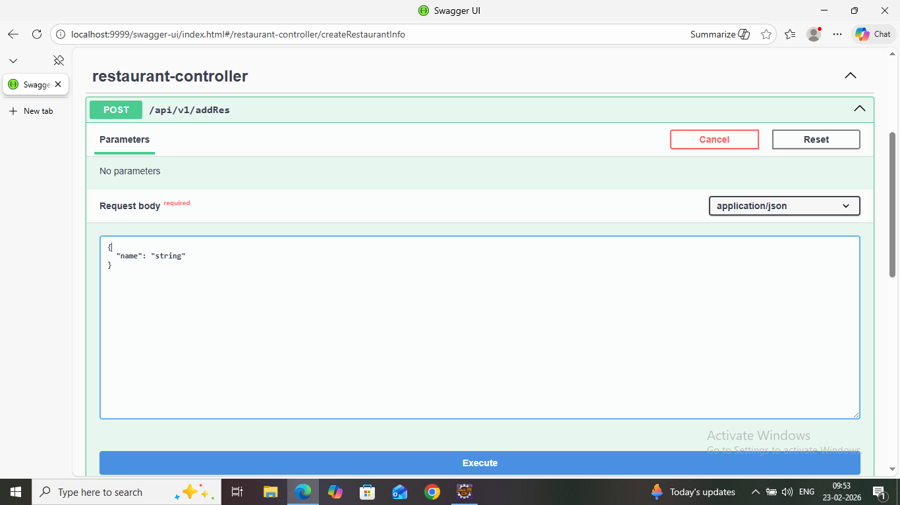
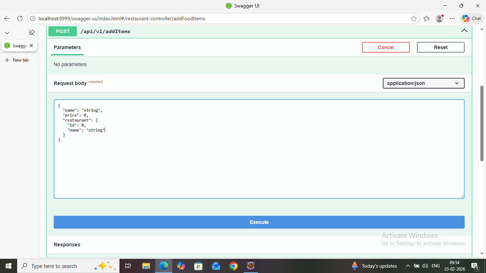
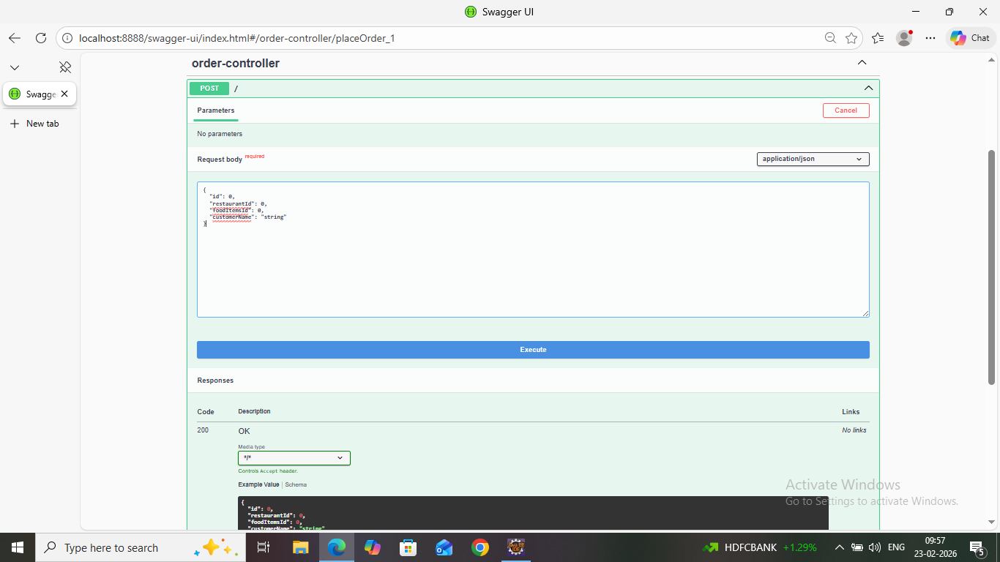
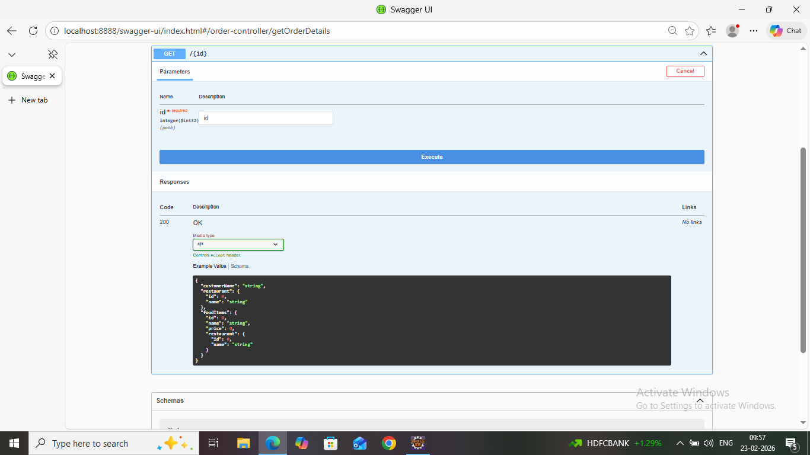
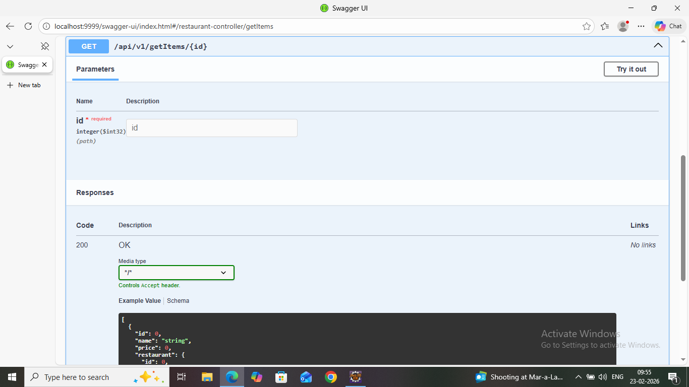
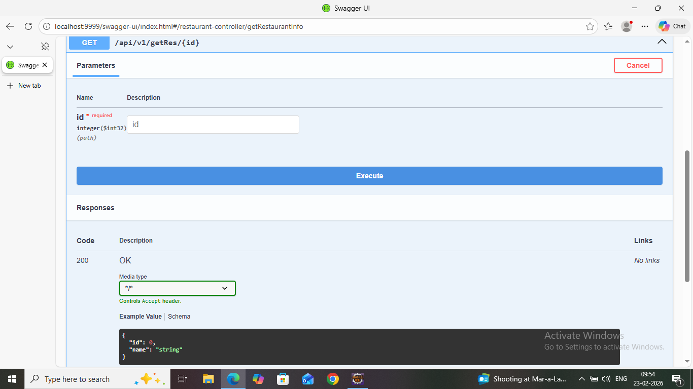
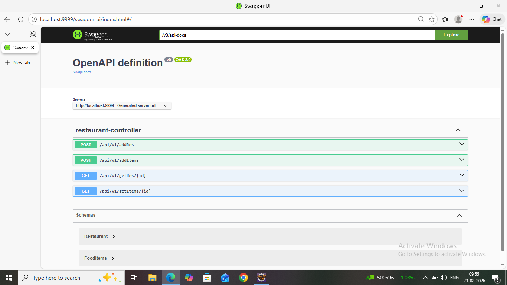
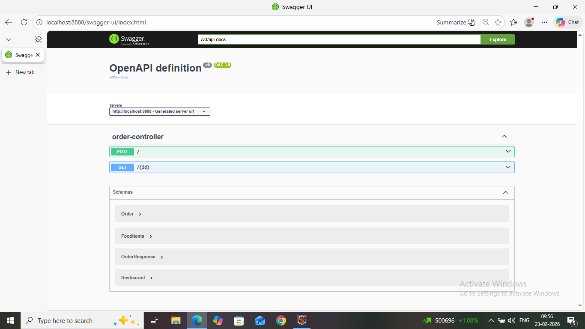

# 🍽️ Restaurant Order Services  

A Spring Boot Microservices-based backend application for managing Restaurants and Orders.

This project demonstrates clean layered architecture, RESTful APIs, independent service deployment, and Swagger documentation.

# 📌 Project Overview

The system is divided into two independent microservices:

🏪 Restaurant Service → Runs on Port 9999  
🛒 Order Service → Runs on Port 8888  

Each service:
- Runs independently
- Follows layered architecture
- Exposes REST APIs
- Uses Swagger for API documentation

# 🏗️ Microservices Architecture Diagram

                         ┌────────────────────────┐
                         │         Client         │
                         │   (Postman/Browser)    │
                         └────────────┬───────────┘
                                      │
                    ┌─────────────────┴─────────────────┐
                    │                                   │
        ┌────────────────────────┐         ┌────────────────────────┐
        │   Restaurant Service   │         │      Order Service     │
        │       Port: 9999       │         │       Port: 8888       │
        └────────────┬───────────┘         └────────────┬───────────┘
                     │                                    │
             ┌───────┴────────┐                  ┌───────┴────────┐
             │   Controller    │                  │   Controller    │
             ├─────────────────┤                  ├─────────────────┤
             │    Service      │                  │    Service      │
             ├─────────────────┤                  ├─────────────────┤
             │   Repository    │                  │   Repository    │
             ├─────────────────┤                  ├─────────────────┤
             │    Database     │                  │    Database     │
             └─────────────────┘                  └─────────────────┘

# 🏛️ Layered Architecture (Inside Each Service)

Controller → Service → Repository → Database

- Controller handles HTTP requests  
- Service contains business logic  
- Repository interacts with database  
- Model represents entities  

# 🛠️ Tech Stack

- Java 17
- Spring Boot
- Spring Data JPA
- Maven
- MySQL / H2
- Swagger (OpenAPI)
- REST APIs

# 🚀 Features

## 🏪 Restaurant Service
- Add Restaurant
- Get Restaurant by ID
- Get All Restaurants

## 🛒 Order Service
- Create Order
- Get Order by ID
- Get Orders by Restaurant ID
- Add Items
- Get Items by ID

# 📡 API Endpoints

## 🔹 Restaurant Service (Port 9999)

| Method | Endpoint | Description |
|--------|----------|------------|
| POST | /restaurant | Add new restaurant |
| GET | /restaurant/{id} | Get restaurant by ID |
| GET | /restaurant/all | Get all restaurants |

Base URL:
http://localhost:9999

## 🔹 Order Service (Port 8888)

| Method | Endpoint | Description |
|--------|----------|------------|
| POST | /order | Create new order |
| GET | /order/{id} | Get order by ID |
| GET | /order/restaurant/{resId} | Get orders by restaurant |
| POST | /items | Add item |
| GET | /items/{id} | Get item by ID |

Base URL:
http://localhost:8888

# ⚙️ How To Run The Project

## 1️⃣ Clone Repository

git clone https://github.com/sathwik-chotu/restaurant-order-services.git  
cd restaurant-order-services  

## 2️⃣ Run Restaurant Service

cd restaurantservice  
mvn spring-boot:run  

Runs at:
http://localhost:9999

## 3️⃣ Run Order Service

cd orderservice  
mvn spring-boot:run  

Runs at:
http://localhost:8888

# 📘 Swagger Documentation

Restaurant Swagger:
http://localhost:9999/swagger-ui.html  

Order Swagger:
http://localhost:8888/swagger-ui.html  

# 📸 Screenshots

## 🏪 Add Restaurant

## 🛒 Add Items

## 📦 Post Order

## 🔎 Get Order By ID

## 🔎 Get Items By ID

## 🔎 Get Restaurant By ID

## 📘 Restaurant Swagger UI

## 📘 Order Swagger UI

# 🔮 Future Enhancements

- API Gateway
- Service Registry (Eureka)
- JWT Authentication
- Docker Support
- Cloud Deployment
- CI/CD Integration

# 👨‍💻 Author

Sathwik Reddy  
GitHub: https://github.com/sathwik-chotu  
